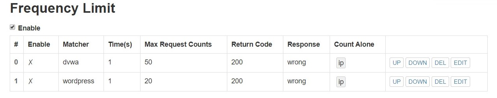

# 第五章：Web服务器（实验）
---

# 实验环境

Ubuntu-18.04
putty
psftp
Windows10主机

---

# 实验步骤

## 安装nginx
`sudo apt install nginx`

## 安装verynginx
```
git clone https://github.com/alexazhou/VeryNginx.git
sudo apt install gcc
sudo apt install make
sudo apt-get install libssl1.0-dev
sudo apt-get install libpcre3 libpcre3-dev
sudo apt-get install zlib1g.dev
sudo python3 install.py install
```
## 修改verynginx配置
`sudo vim /opt/verynginx/openresty/nginx/conf/nginx.conf`


## 启动
`opt/verynginx/openresty/nginx/sbin/nginx`

### 发生报错:


### 解决
#### 查看端口占用情况:
`sudo netstat -ntpl`


使用kill命令强制结束，再重新启动

#### 成功启动verynginx


## 安装mysql
`sudo apt install mysql-server`

## 配置mysql
`sudo mysql_secure_installation`

## 安装Wordpress

### 使用psftp将文件传输至虚拟机中：

```
put C:\Users\25073\Desktop\WordPress-4.7.zip
unzip wordpress-4.7.zip
```

## 配置Wordpress

### 打开mysql
`sudo mysql -u root -p`

### 创建WordPress使用的数据库
`CREATE USER 'wordpress'@'localhost' IDENTIFIED BY 'wordpress';`
#### 发生报错：


发现是密码策略的原因
查看密码策略：


将密码强度设为low：
`set global validate_password_policy=LOW;`

成功


### 继续执行：
```
CREATE DATABASE wp_db;
GRANT ALL ON wp_db.* TO 'wordpress'@'localhost';
```

### 指定wordpress目录 
`WP_PATH=/var/www/wordpress`

### 创建public文件夹 
`sudo mkdir -p ${WP_PATH}/public/`

### 将用户改为www-data 
`sudo chown -R www-data:www-data ${WP_PATH}/public`

### 将解压后的Wordpress拷贝至public文件夹中 
```
sudo cp -r wordpress/* ${Wp_PATH}/public/
cd ${WP_PATH}/public/
sudo cp wp-config-sample.php wp-config.php
```

### 修改配置文件
```
sudo sed -i s/database_name_here/wp_db/ wp-config.php
sudo sed -i s/username_here/wordpress/ wp-config.php
sudo sed -i s/password_here/wordpress/ wp-config.php
```

#### 修改Windows主机的host文件，可以成功ping通


## 配置DVWA

### 下载并解压安装包
```
wget https://github.com/ethicalhack3r/DVWA/archive/master.zip
unzip master.zip
```
### 指定目录并拷贝文件
```
DVWA_PATH=/var/www/dvwa
sudo mkdir -p ${DVWA_PATH}/public/
sudo chown -R www-data:www-data ${DVWA_PATH}/public
sudo cp -r DVWA-master/* ${DVWA_PATH}/public/
cd ${DVWA_PATH}/public/
sudo cp config/config.inc.php.dist config/config.inc.php
```

### 修改配置文件,设置监听端口为8080
### 重启nginx令配置生效
`sudo systemctl restart nginx`

### 成功登录：


---

## 基本要求

* 在一台主机（虚拟机）上同时配置[Nginx](http://nginx.org/)和[VeryNginx](https://github.com/alexazhou/VeryNginx)
    * VeryNginx作为本次实验的Web App的反向代理服务器和WAF
    * PHP-FPM进程的反向代理配置在nginx服务器上，VeryNginx服务器不直接配置Web站点服务
     
* 使用[Wordpress](https://wordpress.org/)搭建的站点对外提供访问的地址为： http://wp.sec.cuc.edu.cn 
* 使用[Damn Vulnerable Web Application (DVWA)](http://www.dvwa.co.uk/)搭建的站点对外提供访问的地址为： http://dvwa.sec.cuc.edu.cn
---

## 安全加固要求

* 使用IP地址方式均无法访问上述任意站点，并向访客展示自定义的**友好错误提示信息页面-1**
  增加以下设置：
  
  
* [Damn Vulnerable Web Application (DVWA)](http://www.dvwa.co.uk/)只允许白名单上的访客来源IP，其他来源的IP访问均向访客展示自定义的**友好错误提示信息页面-2**
  
* 在不升级Wordpress版本的情况下，通过定制[VeryNginx](https://github.com/alexazhou/VeryNginx)的访问控制策略规则，**热**修复[WordPress \< 4.7.1 - Username Enumeration](https://www.exploit-db.com/exploits/41497/)
  
  
* 通过配置[VeryNginx](https://github.com/alexazhou/VeryNginx)的Filter规则实现对[Damn Vulnerable Web Application (DVWA)](http://www.dvwa.co.uk/)的SQL注入实验在低安全等级条件下进行防护
  
  
---

## VeryNginx配置要求

* [VeryNginx](https://github.com/alexazhou/VeryNginx)的Web管理页面仅允许白名单上的访客来源IP，其他来源的IP访问均向访客展示自定义的**友好错误提示信息页面-3**
* 通过定制[VeryNginx](https://github.com/alexazhou/VeryNginx)的访问控制策略规则实现：
    * 限制DVWA站点的单IP访问速率为每秒请求数 < 50
    * 限制Wordpress站点的单IP访问速率为每秒请求数 < 20
    
    * 超过访问频率限制的请求直接返回自定义**错误提示信息页面-4**
    * 禁止curl访问
    
---
# 参考资料
https://github.com/c4pr1c3/LinuxSysAdmin/blob/master/chap0x05.exp.md

https://www.jianshu.com/p/9b4f89a004c3

https://github.com/alexazhou/VeryNginx