#实验目标
制作无人值守安装镜像

---
#实验环境
Ubuntu-16.04.4-desktop

---

#实验流程
1. 将下载好的.iso镜像文件传入虚拟机中
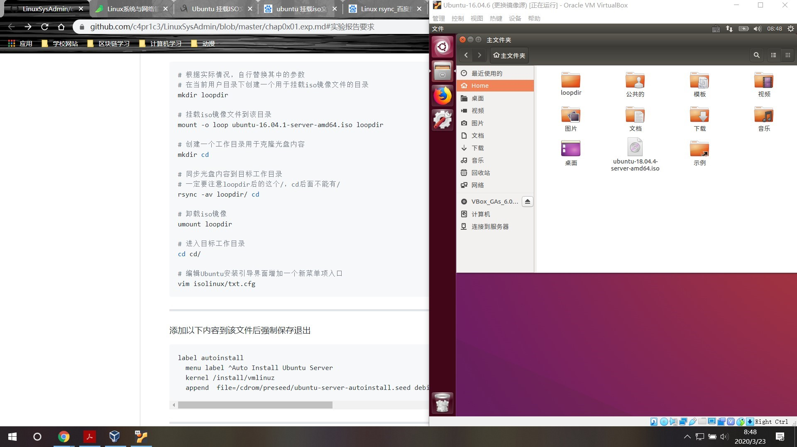
2. 光盘文件不能直接操作，需要先将其挂载
    * 在 Linux 看来，任何硬件设备也都是文件，它们各有自己的一套文件系统（文件目录结构）
    * 所以，当在 Linux 系统中使用这些硬件设备时，只有将Linux本身的文件目录与硬件设备的文件目录合二为一，硬件设备才能为我们所用。合二为一的过程称为“挂载”
3. 创建一个工作目录，将光盘内容同步其中，再将原先挂载的镜像卸载
    * rsync是远程（或本地）复制和同步文件最常用的命令。借助rsync命令，可以跨目录，跨磁盘和跨网络远程与本地数据进行复制和同步
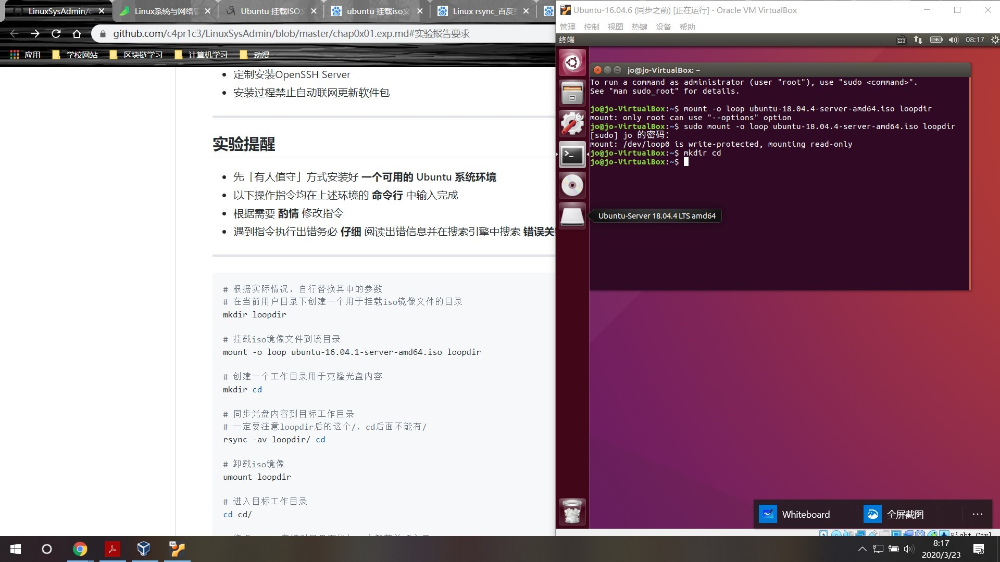
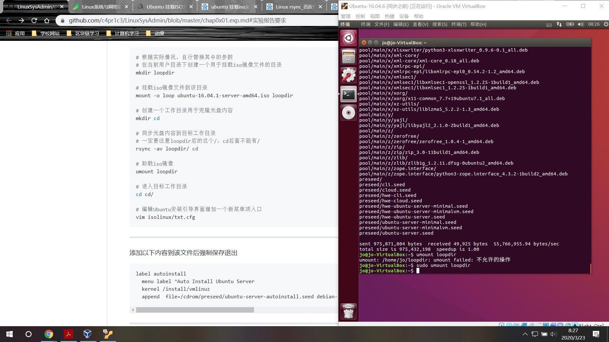
4. 修改txt.cfg文件
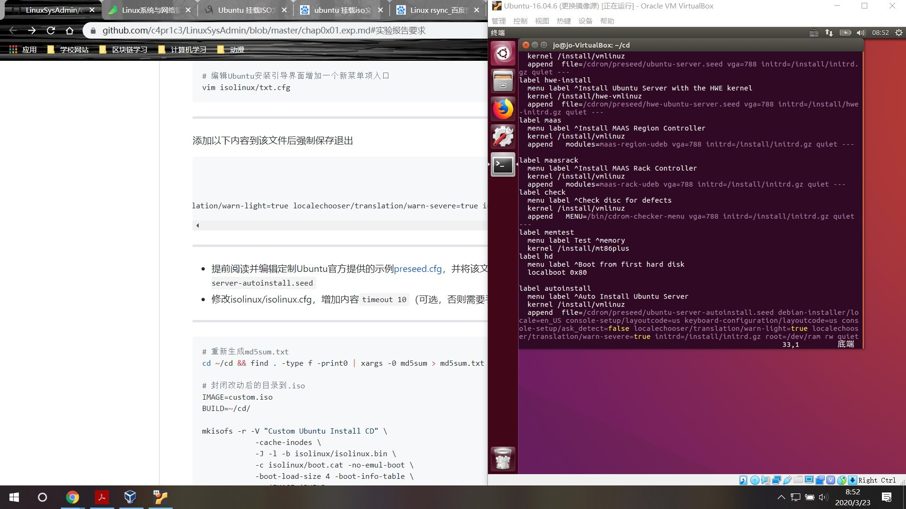
5. 将pressed.cfg示例文件内容存入 cd/pressed/ 中
    * 主文件夹创建ubuntu-server-autoinstall.seed文件，保存源代码
    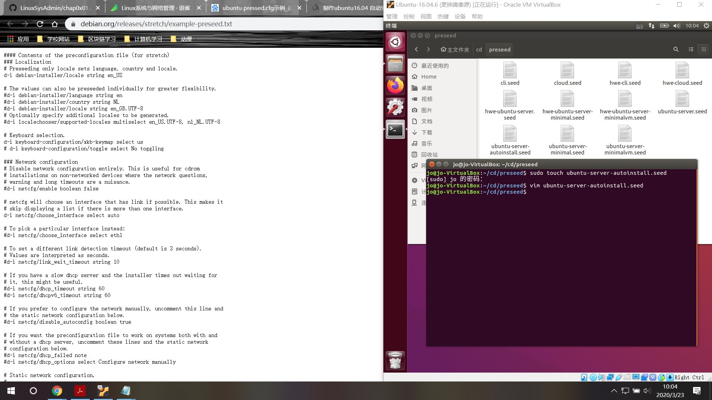
    * 用cp命令将其复制到pressed文件夹
    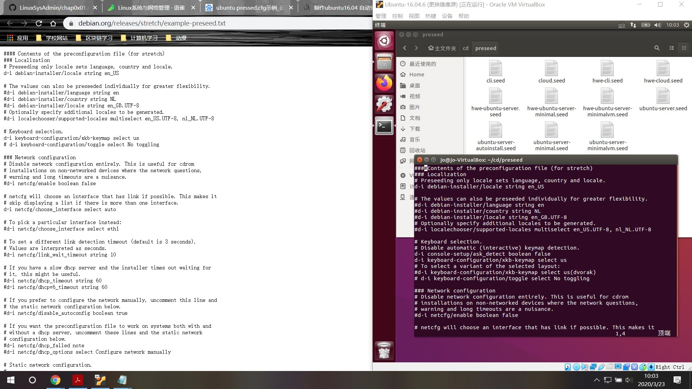
6. 重新生成md5sum.txt
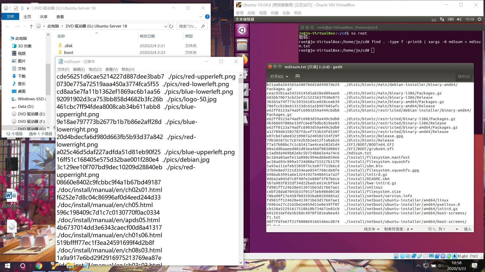
7. 将修改过的文件打包封装成.iso文件
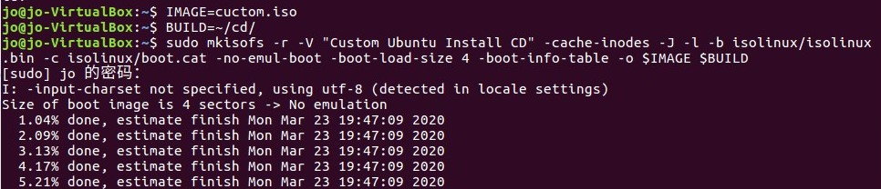
8. 新建一个虚拟机，实现自动化安装

---
#实验实况视频
[无人值守安装](video\VirtualBox.mp4)
由于文件过大无法上传，我会把它压缩。这个链接可能不可用，请于video文件夹中查看。

---
#失败总结

##第一个版本
最开始我试图按课件上的流程走，但是一直莫名卡在挂载镜像这一步。
参考：[老师课件](https://github.com/c4pr1c3/LinuxSysAdmin/blob/master/chap0x01.exp.md#%E5%AE%9E%E9%AA%8C%E6%8A%A5%E5%91%8A%E8%A6%81%E6%B1%82)

后来查看聊天记录发现可能是镜像下载时受损，不完整。我就计算了下载文件的校验和，跟官网进行比对
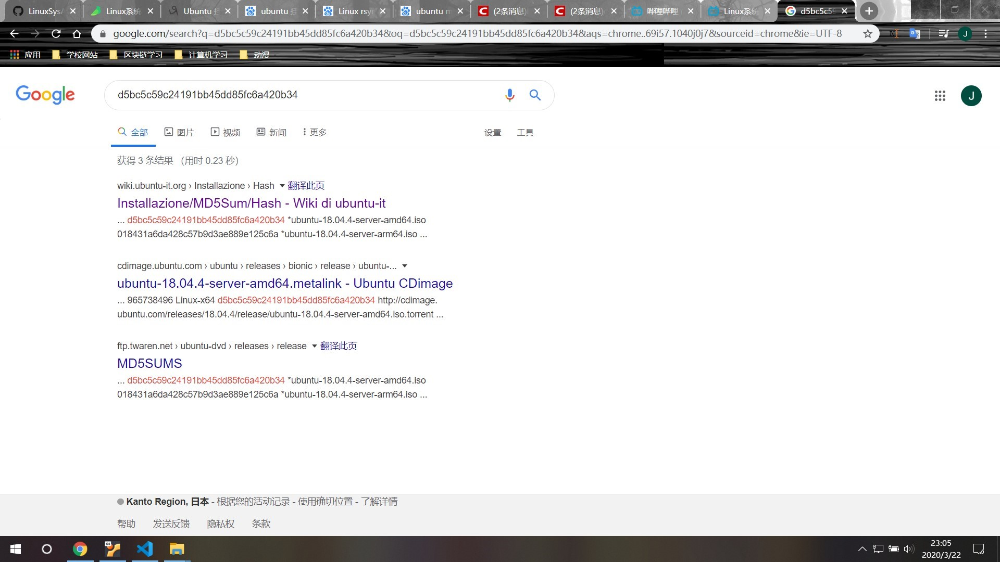
发现没有问题。我一开始懵住了，后来我思考：好像一开始我就没有把.ios文件传给虚拟机，它都不知道文件在哪，怎么挂载呢？
但是我当时还没有看到现在这个完整版课件：[新找到的课件](https://github.com/CUCCS/linux-2020-Loonyluna12345/blob/chap01/chap01/chap0x01_LabReport.md)，我只知道需要把文件传给虚拟机，但那个时候我还不知道在server版本中需要怎么做（使用ssh传输），所以我想换个思路。

##第二个版本
我在网上搜索到了这样一篇文章：[制作ubuntu16.04 自动安装iso镜像](https://blog.csdn.net/weixin_30802273/article/details/99809167)，我决定跟着它走一遍试试。
这次我全程是在win10端操作的，直接下载好16.04版本的镜像，解压，将里面的文件复制一份，进行修改替换
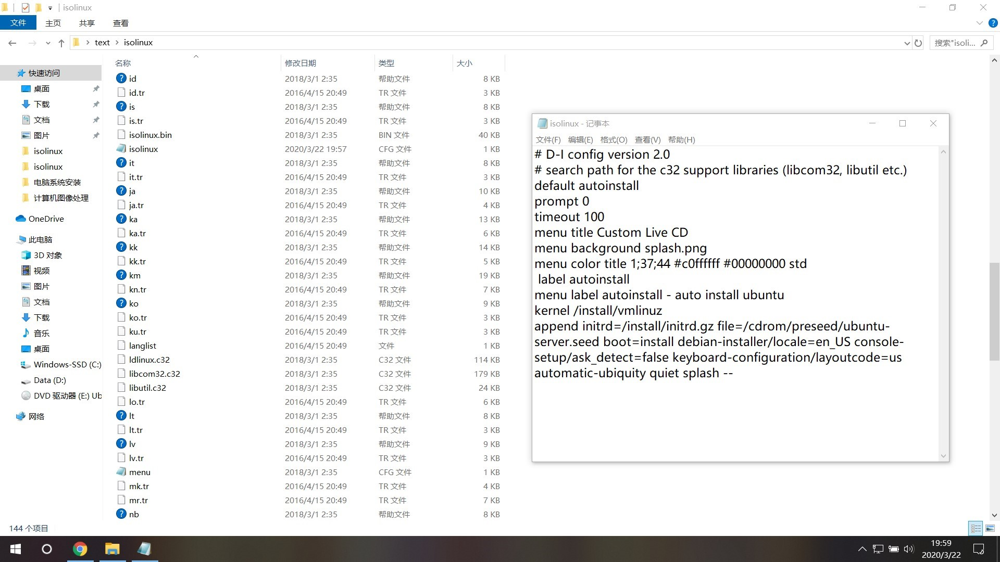
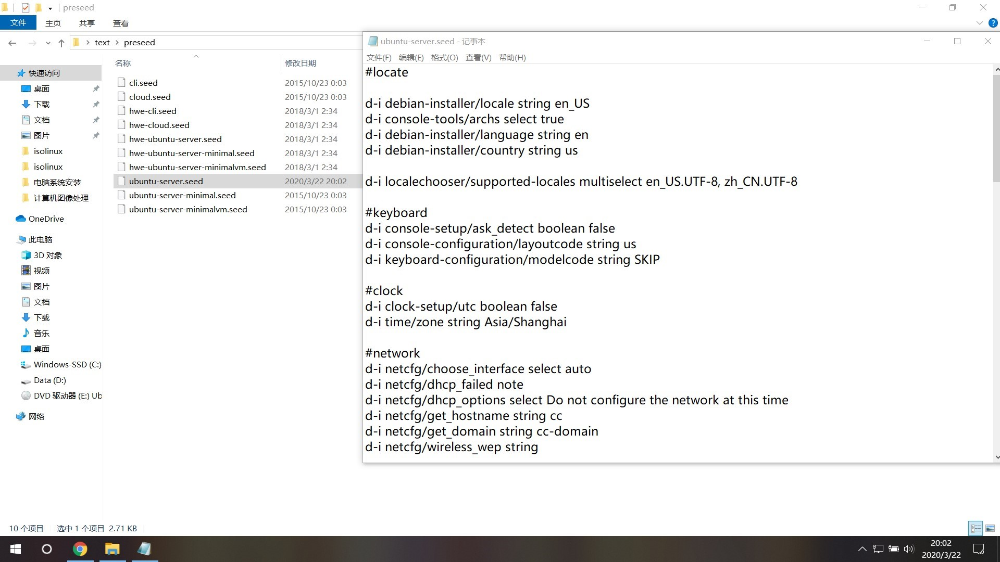
然后使用工具将修改好的文件压缩为.iso格式
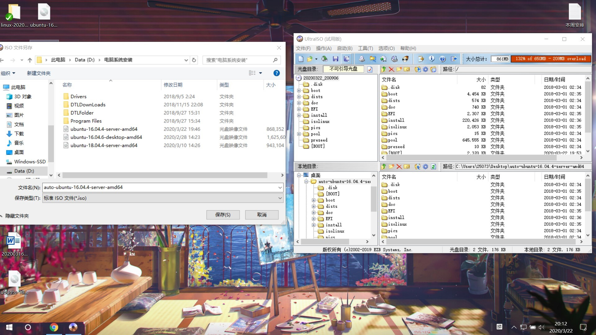
接着就直接在虚拟机里使用了，发现报错：
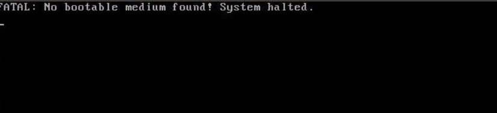
搜索解决的办法，还真有：
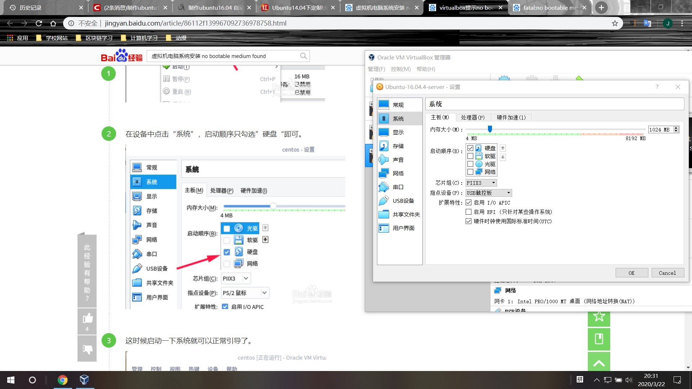
但是完全没能解决问题，报错依然存在。此时我意识到这种方法可能是不可行的，决定放弃。

##第三个版本
此时沿袭我第一个版本的思路：怎样把.iso文件移到虚拟机中。我不知道在server版本里要怎么做，但由于此前我个人做过一些项目，安装过一个16.04版本的桌面版Ubuntu，知道在桌面版要怎么做。正好，这个版本的环境也在此次实验的允许范围内，所以我决定采取这种办法转移文件。这也是我最终成功的版本。

---
#反思
我今天晚上才发现居然还有个新的课件......我反思，我有罪( ´•︵•` )，但由于时间不够了，桌面版的已经快做完了，我就用这个版本来做为提交的作业吧，弄完之后会再去试试如何使用ssh转移文件的。